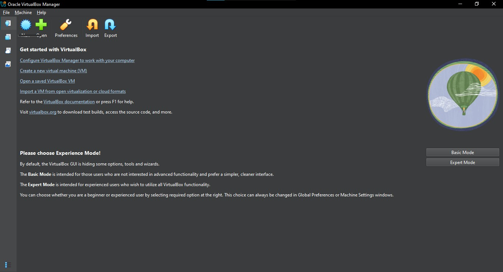
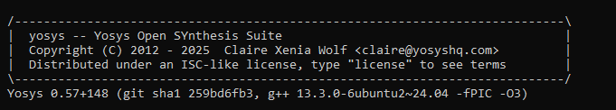
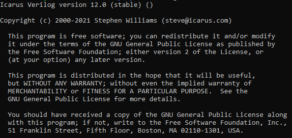
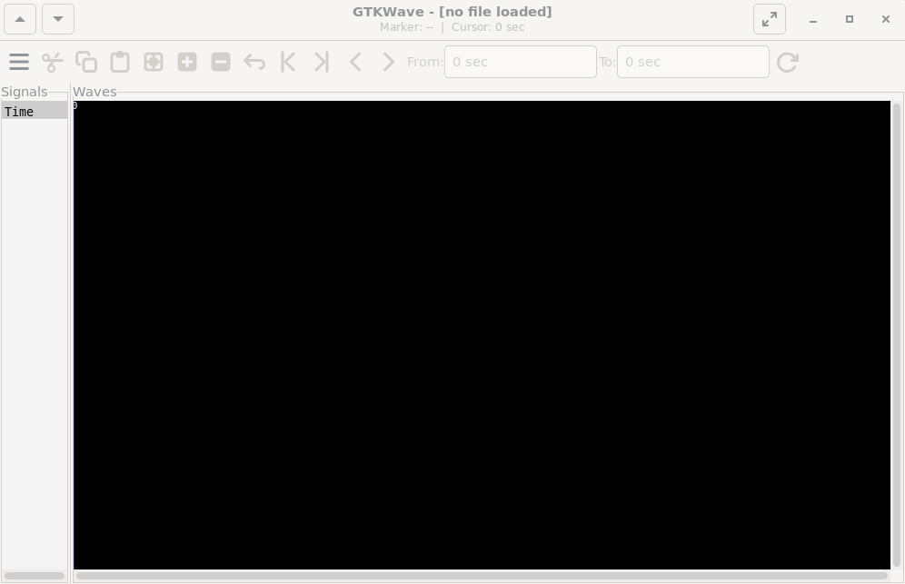

# Day 0 — Tools & Environment Setup
Date: 2025-09-19  

---

## 1. Virtual Machine Setup
Prepared the system environment for the tapeout program.  

** Requirements Verified:**  
- **RAM:** 6 GB  
- **HDD:** 50 GB  
- **OS:** Ubuntu 20.04+  
- **CPU:** 4 vCPU  

🔗 [Download Oracle VirtualBox](https://www.virtualbox.org/wiki/Downloads)  

**Screenshot (VM Setup):**  
  

---

## 2. Yosys — Logic Synthesis Tool
**Installation Steps:**  

```bash
# Update system packages
sudo apt-get update

# Clone Yosys repository
git clone https://github.com/YosysHQ/yosys.git
cd yosys

# Install build tools (if not already installed)
sudo apt install make
sudo apt-get install build-essential clang bison flex \
 libreadline-dev gawk tcl-dev libffi-dev git \
 graphviz xdot pkg-config python3 libboost-system-dev \
 libboost-python-dev libboost-filesystem-dev zlib1g-dev

# Configure, build, and install
make config-gcc
make
sudo make install
```

**Screenshot (Yosys Installed):**  
  

---

## 3. Icarus Verilog (iverilog) — Simulator
**Installation Steps:**  

```bash
sudo apt-get update
sudo apt-get install iverilog
```

**Screenshot (iverilog Installed):**  
  

---

## 4. GTKWave — Waveform Viewer
**Installation Steps:**  

```bash
sudo apt-get update
sudo apt install gtkwave
```

📸 **Screenshot (GTKWave Installed):**  
  

---

## 5. Verification of Installation
After installation, verified all tools:  

```bash
yosys -V     # Check Yosys version
iverilog -V  # Check Icarus Verilog version
gtkwave      # Open GTKWave GUI
```

**Screenshot (Verification):**  
  

---

## 📝 Summary
- Virtual Machine set up successfully.  
- Installed **Yosys**, **Icarus Verilog**, and **GTKWave** without errors.  
- Verified the tools using version checks.  
- Ready to start with **Day 1 tasks** 

---
